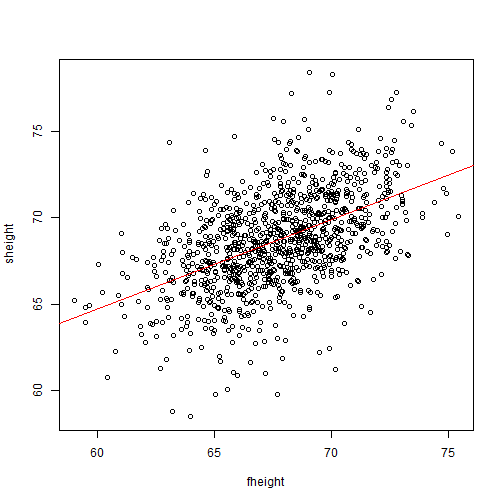

## Developing Data Products

Predicting Sons Height Using Fathers Height

Cousera Data Science

Author: Klevin D.

---
## Objective

This presentation details the shiny application developed for assignment 'Developing Data Products' course of Coursera Data Science course.

The function of this application is to predict the height of the son based on the entered fathers height.

Linear regression model is used as the prediction algorithm.

--- .class #id 

## Requirements

### Data Source
* father.son dataset from library 'UsingR'

### R packages:
* shiny
* UsingR

---


## Cleaning Data Set

Preliminary look at the father.son dataset reveals that there are duplicates in sheight variable.

```r
which(table(father.son$sheight)>1)
```

```
## 70.90129 72.34482 
##      848      975
```

The above measurements are removed from the dataset so as to not bias the regression model.

---


## Exploratory Analysis

Looking at the dataset, there is a visible correlation between the fathers and sons height.


